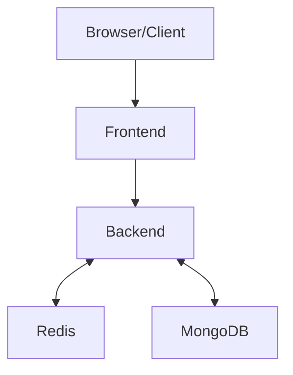

# bookipi-technical
This repo shows frontend and backend applications to handle a flash sale. Frontend shows a single-limited product that is available for the flash fale and the user can only purchase one product during the flash sale period. The objective is handle this sudden surge in traffic, manage inventory accurately, and provide a reliable user experience.

### How it works
Browser retrieves the flash sale setup which contains:
- status of the flash sale
- pre-opening time
- opening time
- closing time
- remaining stock.

Browser displays the product cart, which the data of the product is hardcoded. If the status is upcoming, user will see the counter ticking towards the time the flash sale starts. After the flash sale has been started, User can purchase the product by clicking the Buy Now button. Product card will be updated following how many stock left. User will receive a response of failed transactions if they are already purchased a product or if no more stock left for the flash sale. After the flash sale period has been ended, user cannot purchase the product and counter shows status of expired.

### Project Setup

Frontend 
Go to the ./frontend directory and then run
<code>npm install</code> 
<code>npm run dev</code> 

Backend + Redis + MongoDB 
Open the terminal and run <code>docker-compose up --build</code> from the root directory
Or 
Open the backend directory and run <code>npm install</code> <code>npm run dev</code> 
Initialize flashsalesetups collection on mongoDB to start the project. For example 
<code>db.flashsalesetups.insertOne({ opening: new Date("2025-08-27T09:00:00Z"), preOpen: 3000, stoppedAt: 6000000, stock: 500 })</code>

### Design Choice
Frontend: React, Tailwind. 
Backend: Node JS, Express, Redis, Mongoose. 
Test: Vitest (Frontend), Jest(Backend), Artillery (Backend Stress Test). 
Environment: Node.js version 20.19+
Frontend uses Tailwind for styling (consistent layout).

### System Diagram

### Tests
Frontend: <code>npx vitest</code> 
Backend: <code>npm run test</code> 
Stress Test: <code>artillery run ./stress/flashsale.test.yml</code> 
The result of the stress test can be found in stress directory.
